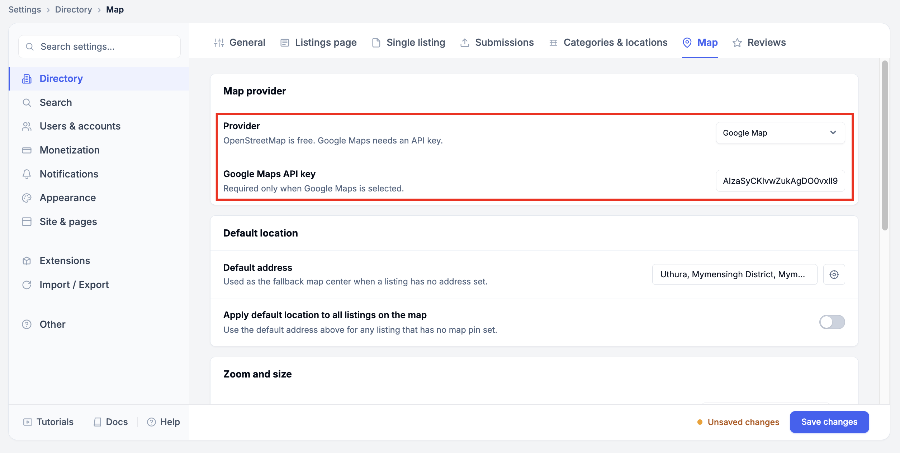
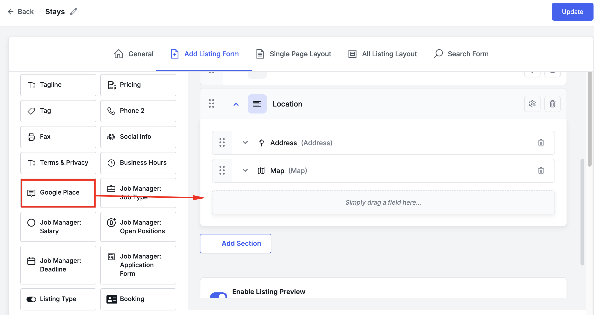
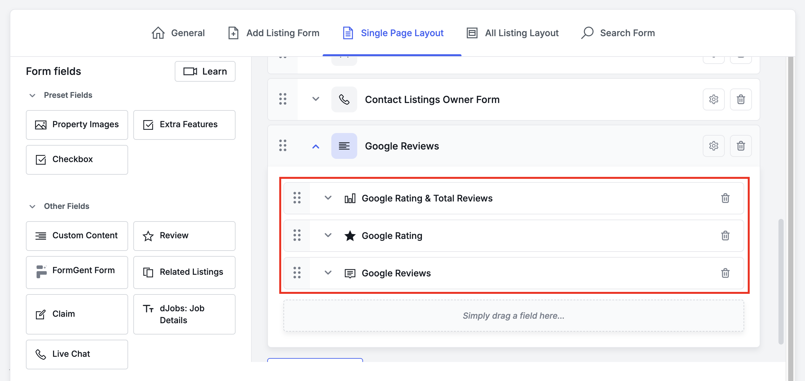
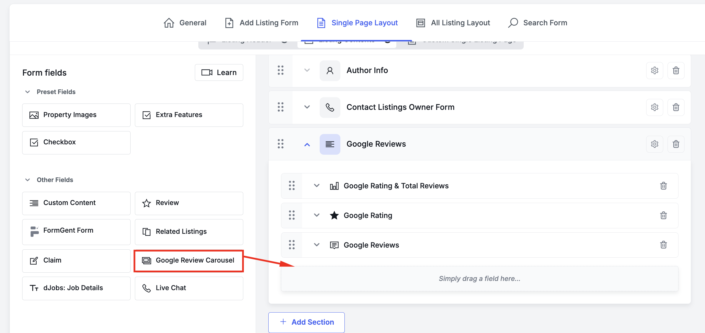
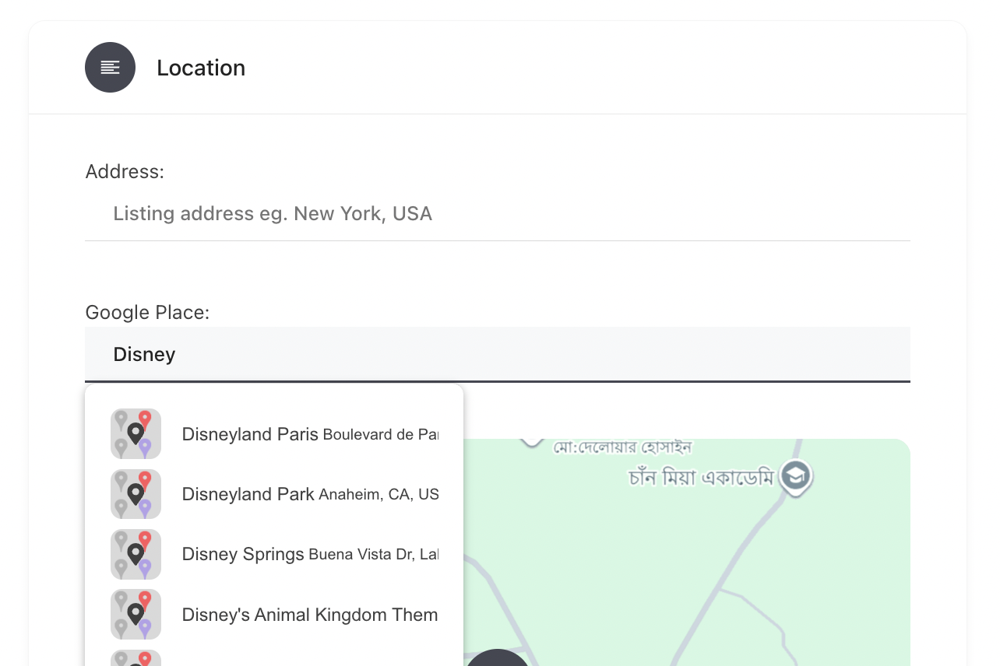
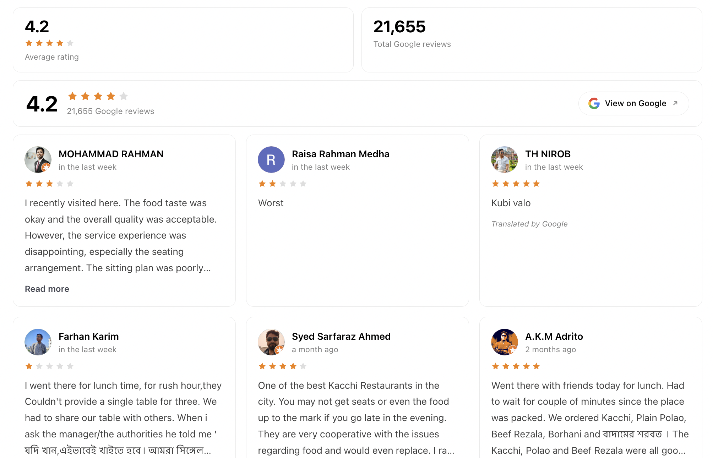
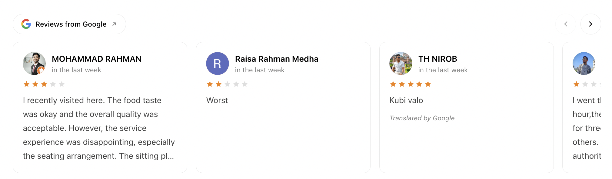

# 📍 Directorist – Google Reviews Extension

**Directorist – Google Reviews** is a third-party extension for the [Directorist](https://directorist.com) plugin that displays real user reviews from Google Places on the single listing page. Improve listing credibility and give users helpful insights from existing Google reviews.

---

## 🚀 Features

- Integrates Google Reviews into Directorist listings
- Autocomplete Google Places field in Add Listing form
- **Reviews are stored in a custom database table** — pages render from the database, not from the Google API
- Automatic refresh every 7 days; between refreshes the API is never called
- **Changing the Google place on a listing resyncs everything immediately on save** — reviews table and post meta both
- Stored data is cleaned up when a listing is deleted
- Average rating and total review count stored in listing post meta
- Four independent single-listing fields (summary bar, compact stats, review cards, review carousel)
- Review carousel built on native CSS scroll-snap — swipeable, keyboard friendly, no third-party slider library
- Responsive review cards with reviewer avatar, star rating, relative date and a *Read more* toggle
- Reviews with written text shown first, then most recent
- Star-only reviews (no written comment) render as compact rating cards rather than being dropped
- Inherits the site's Directorist theme colours through CSS custom properties
- Easy customization with CSS classes and filters

> ℹ️ A single Google Place Details request returns **at most 5 reviews**. The plugin requests both sort modes (`most_relevant` and `newest`), which return different sets, and merges them — so up to **10** reviews are available and the default store limit of 6 is reachable. Reviews that have text are ordered first, then most recent.

📘 Full technical reference: **[DOCUMENTATION.md](DOCUMENTATION.md)**

---

## 📥 Installation

### 🔄 Step 1: Download the Plugin

1. Go to the [GitHub Repo](https://github.com/MahfuzulAlam/directorist-custom-code)
2. Select the **`google/reviews`** branch
3. Click **Code → Download ZIP**
4. Unzip the downloaded file

Alternatively, clone the branch directly:

```bash
git clone --branch google/reviews https://github.com/MahfuzulAlam/directorist-custom-code
```

### 🔌 Step 2: Upload to WordPress

1. Login to your **WordPress dashboard**
2. Go to **Plugins → Add New → Upload Plugin**
3. Upload the unzipped folder or ZIP it before uploading
4. Click **Install Now**, then **Activate**

---

## ⚙️ Setup Instructions

### ✅ 1. Enable Google Maps in Directorist

- Go to: **Directorist → Settings → Directory → Map**
- Set **Provider** to *Google Map* and paste your **Google Maps API key**



The plugin reads this same key — there is no separate key to configure.

### ✅ 2. Enable Required Google APIs

From the [Google Cloud Console](https://console.cloud.google.com/), make sure the following APIs are **enabled**:

- **Maps JavaScript API**
- **Places API**

> 🧾 Billing must be active on your Google Cloud project.

---

## 📝 Form Configuration

### 📌 Add Listing Form

1. Go to: **Directorist → Directory Builder → Add Listing Form**
2. Drag the **Google Place** field into any section
3. Save changes



This is the field listing owners use to search for their business. Everything
else the plugin displays is derived from the place they pick here.

### 🧩 Single Page Layout

The plugin adds **four independent fields**, so the rating, the stats and the
reviews can each be placed wherever you want them:

| Field | Group in the builder | Renders |
| --- | --- | --- |
| **Google Rating** | Other Fields | Summary bar — average score, stars, review count, *View on Google* |
| **Google Rating & Total Reviews** | Other Fields | Two compact stat tiles: average rating and total review count |
| **Google Reviews** | Preset Fields | The review cards |
| **Google Review Carousel** | Other Fields | The same cards in a horizontally scrolling carousel with arrows and dots |

All four read from local storage — none of them call the Google API directly.

1. Go to: **Directorist → Directory Builder → Single Page Layout**
2. Create a new section (the example below uses one called *Google Reviews*)
3. Drag in any combination of the four fields
4. Save changes



> 💡 **Google Reviews** sits under *Preset Fields*; the rating fields and the
> carousel sit under *Other Fields*. See [DOCUMENTATION.md § 8](DOCUMENTATION.md#8-single-listing-fields)
> for why they are in different groups.

The carousel field is dragged in from *Other Fields* like the rating fields:



---

## 📊 Output Preview

### Add Listing Page:
Listing owners type a business name and pick it from the Google suggestions:



### Single Listing Page:
All three fields rendered together — the stat tiles, the summary bar and the
review cards:



Star colour follows your theme: it inherits `--directorist-color-star`, which is
why the stars above are orange rather than Google yellow. Override
`--dgr-star` to change it independently.

### Review Carousel:
The **Google Review Carousel** field renders the same cards in a scroll-snap
track — the arrows and dots appear once JavaScript loads:



---

## 🎨 CSS Customization

The widget is themed with custom properties, so most changes need only a token override:

```css
.dgr-reviews {
    --dgr-radius: 12px;          /* card + summary corner radius */
    --dgr-border: #e9e9e9;       /* card border */
    --dgr-surface: #ffffff;      /* card background */
    --dgr-heading: #1a1a1a;      /* names and score */
    --dgr-text: #404040;         /* review body */
    --dgr-muted: #808080;        /* dates and counts */
    --dgr-accent: #4285f4;       /* links and Read more */
    --dgr-star: #fbbc04;         /* filled stars */
    --dgr-gap: 16px;             /* grid gap */
}
```

The full class list:

```css
.dgr-reviews {}                  /* wrapper */
.dgr-reviews__summary {}         /* rating summary bar */
.dgr-reviews__score {}
.dgr-reviews__score-value {}     /* the large average, e.g. 4.6 */
.dgr-reviews__score-count {}     /* "1,284 Google reviews" */
.dgr-reviews__source {}          /* View on Google pill */
.dgr-reviews__list {}            /* responsive card grid */
.dgr-review {}                   /* single review card */
.dgr-review__avatar {}
.dgr-review__author {}
.dgr-review__time {}
.dgr-review__text {}
.dgr-review__para {}             /* a paragraph inside a review */
.dgr-review__toggle {}           /* Read more / Show less */
.dgr-review__translated {}
.dgr-stars {}                    /* star row, fractional fill supported */
.dgr-carousel {}                 /* carousel wrapper */
.dgr-carousel__track {}          /* scroll-snap track */
.dgr-carousel__slide {}          /* one card in the carousel */
.dgr-carousel__arrow {}          /* prev / next buttons */
.dgr-carousel__dot {}            /* pagination dots */
```

Add your styles via `Appearance → Customize → Additional CSS` or your theme's `style.css`.

---

## 🔧 Developer Filters

```php
// Reviews kept per listing in the database. Default: 6
add_filter( 'dgr_reviews_store_limit', function() { return 4; } );

// Reviews rendered on the page. Default: 6
add_filter( 'dgr_reviews_display_limit', function() { return 3; } );

// Reviews shown in the carousel. Default: 6
add_filter( 'dgr_carousel_display_limit', function() { return 4; } );

// How long stored data stays fresh, in seconds. Default: 7 days
add_filter( 'dgr_refresh_interval', function() { return WEEK_IN_SECONDS * 2; } );

// Primary sort: 'most_relevant' or 'newest'. Default: 'most_relevant'
add_filter( 'dgr_reviews_sort', function() { return 'newest'; } );

// Request both sort modes and merge them. Default: true
// This is what allows more than 5 reviews — one request is capped at 5, but
// the two sort modes return different sets.
add_filter( 'dgr_merge_review_sorts', '__return_false' );

// Sync immediately when a listing's Google place changes. Default: true
// With this off, the old data is still purged on save, but the refresh waits
// for the next page view.
add_filter( 'dgr_sync_on_place_change', '__return_false' );
```

Action fired after a listing is refreshed from Google:

```php
add_action( 'dgr_listing_synced', function( $listing_id, $place_id, $place ) {
    // $place: rating, user_ratings_total, url, reviews
}, 10, 3 );
```

---

## 🗄 Where the data lives

| What | Where |
| --- | --- |
| Reviews | Custom table `{prefix}dgr_google_reviews` |
| Average rating | Post meta `_dgr_rating` |
| Total reviews | Post meta `_dgr_reviews_total` |
| Last sync time | Post meta `_dgr_synced_at` (UTC datetime) |
| Google Maps URL | Post meta `_dgr_place_url` |
| Synced place ID | Post meta `_dgr_place_id` |

When an owner picks a different place on the Add Listing form, the stored
reviews and meta for the old place are dropped and refetched on save — see
[DOCUMENTATION.md § 5](DOCUMENTATION.md#5-save-time-sync).

See [DOCUMENTATION.md](DOCUMENTATION.md) for the full schema and refresh logic.

---

## 🛠 Support

This is a **third-party plugin**. For support, please contact:

📩 **Email:** asayeedalam@gmail.com

---

## 🧾 License

This extension is released under the [GPLv2 or later](https://www.gnu.org/licenses/gpl-2.0.html).

---

## 🤝 Credits

Developed for use with the [Directorist](https://directorist.com) plugin by SovWare.

---
